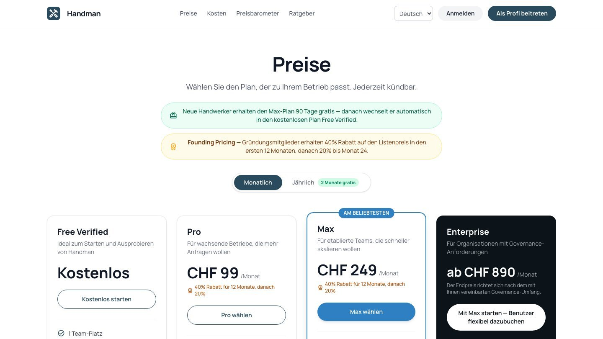

## Responsibilities

- **Web app:** main contributor to the React and TypeScript app: home page, sign-in, account, company and billing settings, security settings.
- **Backend:** FastAPI endpoints, database migrations and background jobs for the features I worked on.
- **Payments:** TWINT and tap-to-pay on-site payments; subscription billing.
- **Sign-in:** passkeys (Face ID / fingerprint) and email magic links.
- **AI assistant:** structured job requests, role-based entry points and voice input in the web app.
- **SEO:** pre-rendering, structured data, four-language URLs, redirects, sitemaps.
- **Testing:** end-to-end tests for key user journeys.

