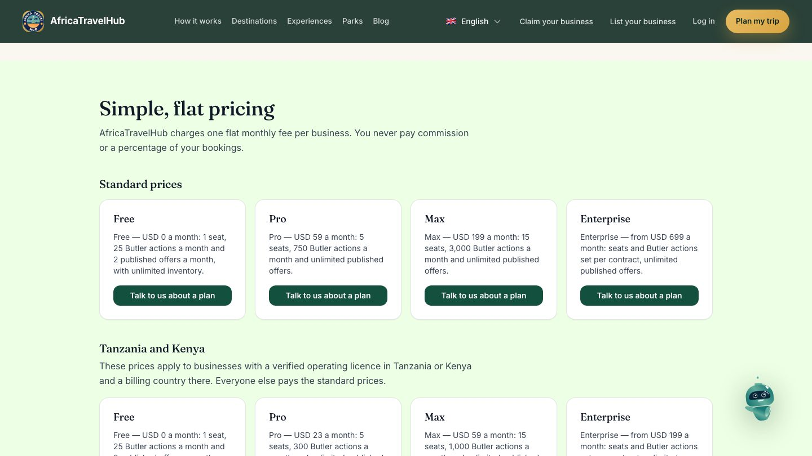
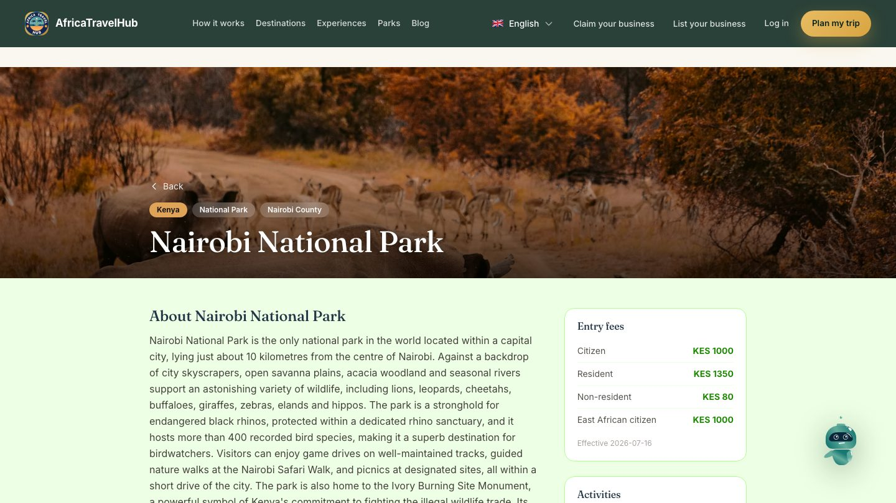

## Pages I worked on

**Pricing page.** It returned 404 before. I built it with structured data so search engines can read the plans.

**Park page.** One of 14 park pages that Google used to see as blank. I also cut this page from 13.1 MB to 1.6 MB.

